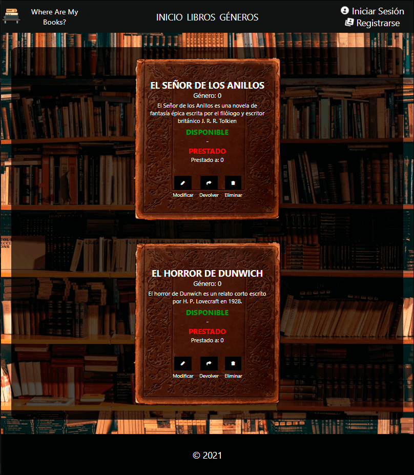

# Biblioteca-React-UTN

Trabajo práctico grupal de la diplomatura en desarrollo web full stack con React brindada por la UTN.

## Grupo 9, integrantes:

- Amaya, Gastón
- Barajas, Valentín
- De Giovannini, Augusto
- Melani Ghirardi, Maximiliano
- Peirone, Marcos
- Rossi, Bruno

## Consigna y objetivos:

Se trata de un proyecto de desarrollo frontend en React, utilizando como servidor, el tp desarrollado en NodeJs para los modulos 3 y 4. Se debe realizar un frontend para mostrar e ingresar todas las consultas que su servidor NodeJs ofrece, por lo tanto:

### Se requiere:

- Persona
  - Formulario para ingresar una nueva persona (amigos a los que les prestare libros)
  - Un listado o cards desde el que se puedan ver todas las personas y tenga funcion para borrar y modificar sus datos (pueden ser iconos o botones)
  - Se tiene que poder ver los libros que tiene una persona prestados (es decir, los libros que le preste)

- Generos
  - Formulario para ingresar un nuevo genero
  - Un listado o cards de generos donde tambien se cuente con la funcionlidad de borrado o modificacion
  - Se tiene que poder ver todos los libros de un genero, puede ser una funcionalidad extra en el listado/card del punto anterior o bien otra pantalla donde se seleccione el genero y muestren los libros

- Libro
  - Formulario para ingresar nuevo libro
  - Listado de todos los libros que muestre el alias de la persona que lo tiene, en caso de estar prestado, debe contar con boton para borrar, modificar, prestar/devolver libro
  

## Instalación y ejecución

Se debe contar con el servidor( https://github.com/Marc2p/Biblioteca-diplomatura-UTN ) instalado y ejecutado en una terminal.
Clonar el presente repositorio, ingresar al directorio raíz, ejecutar 'npm install' y luego 'npm start' para ejecutar la app en otra terminal.

## Previsualización

